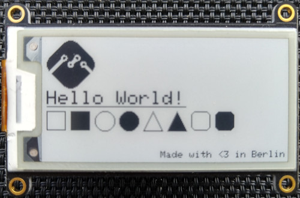

# Adafruit E-Paper / E-Ink Library for Mongoose OS

[](https://travis-ci.org/bbilger/mgos-arduino-adafruit-epd)
[](LICENSE)

## Introduction
This is a port of or rather a wrapper around the [Adafruit EPD Library](https://github.com/adafruit/Adafruit_EPD) for [Mongoose OS](https://mongoose-os.com/).

Please check [Adafruit EPD Library](https://github.com/adafruit/Adafruit_EPD) for additional information
and also please note the original [README](README_ORIG.md).

Note: EPD stands for e-paper display.

## Usage

### Examples

There are three examples that show how to use this library:

- [C usage example](examples/hello_c/README.md)
- [JavaScript or rather mJS usage example](examples/hello_js/README.md)
- [C++ usage example](examples/hello_cpp/README.md)



### C

```C
#include "mgos_aepd.h"
...
// get the e-paper display as configured in mos.yml
Adafruit_EPD *epd = mgos_aepd_get_global();
// methods of the Adafruit_EPD C++ class
// can be invoked through "mgos_aepd_<snake_case_method_name>(epd, ...)"
mgos_aepd_some_method(epd, ...);
...
```

### JavaScript / mJS

```JavaScript
load('api_arduino_adafruit_epd.js');
// get the e-paper display as configured in mos.yml
let epd = ArduinoAdafruitEpd.createGlobal();
// the JavaScript object has the same / most methods the original Adafruit_EPD C++ class has
epd.someMethod(...);
```

### C++

```C++
#include "Adafruit_EPD.h"
#include "mgos_aepd.h"

// get the e-paper display as configured in mos.yml
Adafruit_EPD *epd = mgos_aepd_get_global();
// nothing fancy here, since one can use the original Adafruit_EPD C++ class directly
epd.someMethod(...);

```

## Configuration

It's optional to setup the display using the following config but unless you are using more than one display this if probably what you want.

| config                 | type     | default | required | comment |
| ---------------------- | -------- | ------- | -------- | --------|
| aepd.enable            | `bool`   | `false` | -        | If enabled, then the display will be setup automatically by the library and the reset of the config must be valid. |
| aepd.begin             | `bool`   | `true`  | -        | Calls `begin` on the display automatically on start.
| aepd.driver            | `string` | `empty` | `true`   | The driver to use for the connected display. At the moment the following drivers are implemented: "IL0373", "IL0398", "IL91874", "SSD1608", "SSD1675". |
| aepd.width             | `int`    | `-1`    | `true`   | Display width in pixels. |
| aepd.height            | `int`    | `-1`    | `true`   | Display height in pixels. |
| aepd.epd_spi_cs_index  | `int`    | `-1`    | `true`   | `spi.csX_gpio` index for the EDP, 0, 1 or 2. |
| aepd.sram_spi_cs_index | `int`    | `-1`    | `false`  | `spi.csX_gpio index` for the SRAM, 0, 1 or 2, or -1 to not use SRAM. |
| aepd.epd_dc_gpio       | `int`    | `-1`    | `true`   | EPD DC GPIO. |
| aepd.epd_reset_gpio    | `int`    | `-1`    | `false`  | EPD reset GPIO or -1 |
| aepd.debug             | `bool`   | `false` | -        | At the moment it only prevents a bootloop on misconfiguration.

If you whish to not setup the display via configuration, then you can set it up in C via `mgos_aepd_create`, in C++ by directly instantiating a concrete subclass of `Adafruit_EPD` (e.g. `Adafruit_SSD1675`), and in JS you are on your own but you can for example "ffi" `mgos_aepd_create`.

 ## License

This library is - like the original one - licensed under [MIT license](LICENSE).
